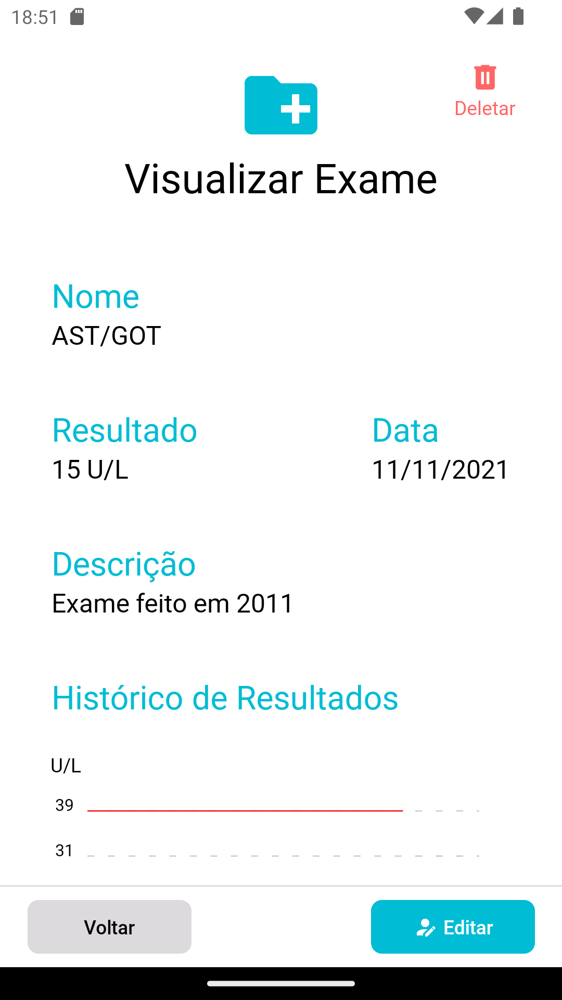
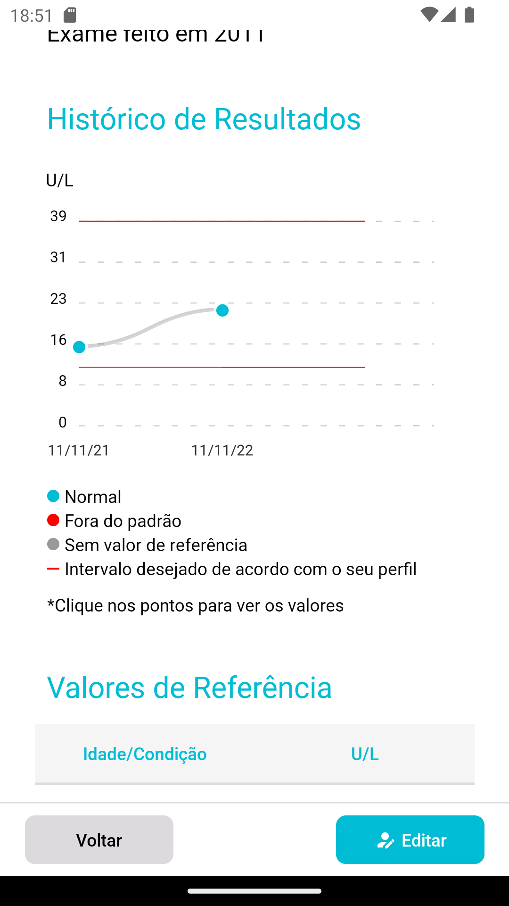
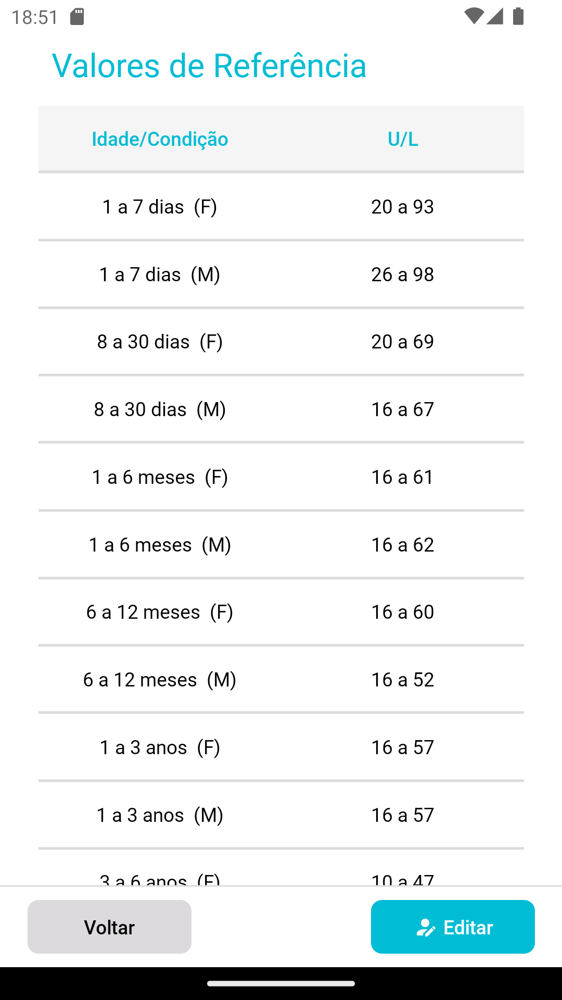

<h1 align="center">
  <br>
  <a href="https://github.com/aphiex/aphiexapp.git"></a>
  <br>
  APHIEX
  <br>
</h1>

<h4 align="center">Aplicativo de histórico de exames laboratoriais para uso pessoal.</h4>

<p align="center">
  <a href="#principais-funcionalidades">Principais Funcionalidades</a> •
  <a href="#como-usar">Como Usar</a> •
  <a href="#download">Download</a> •
  <a href="#licença">Licença</a>
</p>

<p align="center">
  
  
  
  
</p>


## Principais Funcionalidades

* Cadastro de multiplos perfis
* Cadastro de exames laboratoriais
* Cadastro de médicos
* Cadastro de locais
* Acompanhamento do histórico de exames

## Como Usar

Para clonar e executar esta aplicação, você precisará ter o [Git](https://git-scm.com), [Node.js](https://nodejs.org/en/download/) (que vem com o [npm](http://npmjs.com)), [Yarn](https://classic.yarnpkg.com/lang/en/docs/install/#windows-stable) e [Expo](https://docs.expo.dev/get-started/installation/) instalados em seu computador. No seu terminal:

```bash
# Clone o repositório
$ git clone https://github.com/aphiex/aphiexapp.git

# Entre no repositório
$ cd aphiexapp

# Instale as dependencias
$ yarn

# Execute a aplicação
$ yarn start
```

## Download

Voce pode baixar a versão do app para Android clicando [aqui](https://github.com/aphiex/aphiexapp.git).

## Licença

Apache License 2.0

---

Autores: [@danielmpadua](https://github.com/danielmpadua) e [@ribeiromarcos](https://github.com/ribeiromarcos)
